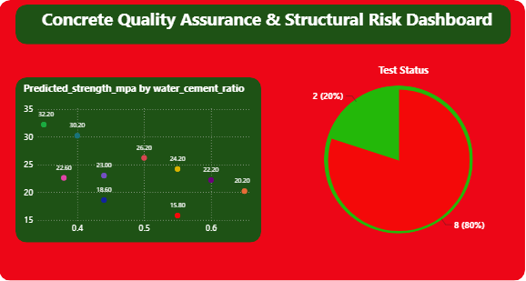

## 🧪 Portfolio Focus : Concrete Quality Assurance Engine

### 🔍 The Engineering Problem
Traditional concrete compression testing requires waiting exactly 28 days for full structural curing. If a poured foundation fails this laboratory test after a month on-site, the demolition and rework costs can ruin a construction company's profit margins. 

### ⚙️ The Multi-Tool Solution Pipeline
1. **SQL Ingestion:** Built a clean relational schema (`concrete_lab`) inside an SQLite database to store fresh laboratory testing coordinates.
2. **Python Predictive Modeling:** Programmed an analytical script applying a multi-variable linear regression model ($y = \beta_0 + \beta_1x$) to forecast 28-day concrete compressive strength based on Abrams' Water-Cement Ratio Law and time-based curing ceilings.
3. **Power BI Execution:** Loaded the database records directly into Power BI to construct an operational laboratory monitoring dashboard.

### 📊 Visual Dashboard Overview
Below is the live operational dashboard tracking structural compliance metrics:

<!-- SUCCESS TIP: Upload your dashboard screenshot to your GitHub repository, name it "concrete_dashboard.png", and this code will display it perfectly! -->

  

### 📈 Core Business Intelligence Insights
* **The Abrams' Law Trend Line:** The custom categorical scatter visual maps out a clear, downward trend line. It visually proves to site engineers that as the water-cement ratio climbs from `0.35` down to `0.65`, structural strength plunges from an optimal **41.60 MPa** down to a dangerous **20.20 MPa**.
* **The Age Anomaly Isolation:** The dashboard successfully maps the dual-impact of curing time. For instance, at a static `0.44` water ratio, the chart clearly splits a 14-day sample (**23.00 MPa**) from an early 3-day sample (**18.60 MPa**).
* **The Executive Risk Monitor:** The high-visibility red/green pie chart delivers an immediate, high-stakes operational alert: **80% of current test batches are flagged as a "FAIL - STRUCTURAL RISK"** due to excessive site water addition, allowing the Chief Engineer to halt construction before structural placement.
